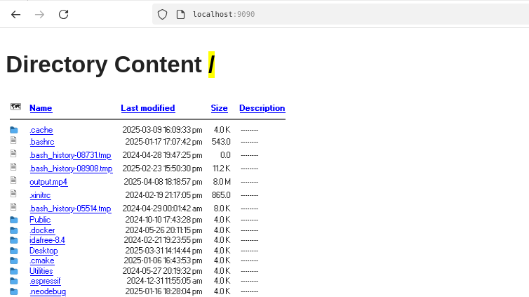

# Ftp-FM 


Serve as a fast local http server and FTP utility.  
You can also use it to browse files like File Manager but in the Navigator. 

Quite simple to use. Type the `--help` flag to get the usage summary. 

NOTE: By default, if the target directory contains an `.html` or `.htm` index, priority is given to displaying these files.

###  Project Structure 
   ## base Structure 
    config / - basic configuration, 
    include/ - header files 
    src    / - source files

   ## After build
    + bin/   - hold the final binary 
    + lib/   - hold the needed library 

### Prelude  

```bash 
$ git clone https://github.com/Galsen-Low-Level/Ftp-FM --recursive 
``` 
 
### Quick assessment 

This section is for those who want to get a quick overview of the project using Docker. 
Here's an example: 

```bash                 
                        ___________
                        v          v
$ docker  run   -v ~/Desktop/:/opt/local -p 9090:9090 ftpfm   /ftp-FM/bin/ftpFM  -t /opt/local
                                   ^---------------------------------------------------^
```      
*The contents of the Desktop folder are volume-mounted on /opt/local and the program will point to this folder to display the contents of the volume-mounted folder.* 


### Build 
---  
The default build tool is `Cmake` 

to build it, use the following command

```bash 
cmake -B build 
cmake --build build  
```

the binary source is located in the ./bin folder 
the ./lib folder contains the libraries (you can browse them)   

### Have fun 
launch binary : 

```
$ ./bin/ftpfm -h # to get help 
$ ./bin/ftpfm  # launch on default port 9090 
```

### ScreenShot 




**_Happy Hacking Folks_**

Feel free to contribute.

We ❤️  Computers at all Levels.

From Senegal. 🇸🇳

